# AI-Powered Selenium Locator Analyzer

A Spring Boot service that uses local LLMs to analyze failed Selenium locators and suggest alternatives across **ALL** Selenium locator types.

## ✨ Key Features

- 🎯 **All Selenium Locators** - ID, Name, ClassName, TagName, LinkText, PartialLinkText, CSS, XPath
- 🤖 **AI-Powered** - Local LLM analysis with confidence scores and explanations
- ⚡ **Smart Preprocessing** - 90%+ HTML size reduction for large pages
- 🏆 **Priority Recommendations** - ID > Name > LinkText > CSS > XPath
- 🛠️ **SOLID Architecture** - Clean, testable, maintainable design
- 📊 **Built-in Observability** - Full LLM interaction logging

## 🚀 Quick Start

### Prerequisites
- Java 21+
- Maven 3.6+
- Ollama with llama3.2

### Setup

```bash
# Install Ollama
curl -fsSL https://ollama.ai/install.sh | sh
ollama pull llama3.2

# Clone and run
git clone <repo-url>
cd MySimpleSpringBootAgent
mvn spring-boot:run
```

Service runs at `http://localhost:8080`

### Test It

```bash
# Health check
curl http://localhost:8080/api/locators/health

# Test endpoint
curl http://localhost:8080/api/locators/test

# Analyze a locator
curl -X POST http://localhost:8080/api/locators/analyze \
  -H "Content-Type: application/json" \
  -d '{
    "htmlContent": "<html><body><input id=\"search\" name=\"q\"/></body></html>",
    "locator": "//*[@id=\"wrong\"]",
    "pageUrl": "https://example.com"
  }'
```

**Response:**
```json
{
  "recommendedLocatorType": "ID",
  "recommendedLocator": "search",
  "byId": "search",
  "byName": "q",
  "primaryCssSelector": "#search",
  "primaryXPath": "//*[@id='search']",
  "confidence": 95,
  "elementFound": true,
  "explanation": "Use By.id for best reliability"
}
```

## 📖 How It Works - Visual Flow

### Main Process Flow

```mermaid
sequenceDiagram
    participant User as User/Client
    participant API as Spring Boot API
    participant HTML as HtmlPreprocessor
    participant Tools as DomQueryTools
    participant AI as Claude AI
    participant Response as ResponseMapper

    User->>API: POST /analyze<br/>(locator, htmlContent,<br/>description, url)
    API->>API: ✓ Validate request
    API->>HTML: Preprocess HTML<br/>(clean, optimize)
    HTML-->>API: Jsoup Document<br/>(cleaned HTML)
    API->>Tools: Store in ThreadLocal<br/>(accessible to AI)

    API->>AI: Call analyzeLocator()<br/>ONLY sends:<br/>- locator string<br/>- description<br/>- pageUrl<br/>(NO HTML!)

    Note over AI: AI analyzes without full HTML
    AI->>Tools: findByXPath(xpath)<br/>Query the stored HTML
    Tools-->>AI: Results

    AI->>Tools: getAllInteractiveElements()<br/>See what's available
    Tools-->>AI: List of buttons/inputs

    AI->>Tools: findByCss(selector)<br/>Test alternatives
    Tools-->>AI: Match found

    AI-->>API: LocatorAnalysisResult<br/>(recommendations)

    API->>Tools: Clear ThreadLocal<br/>(cleanup)
    API->>Response: Convert to response
    Response-->>API: LocatorAnalysisResponse
    API-->>User: 200 OK + JSON<br/>with alternatives
```



### Why HTML is NOT Sent to AI


**Key Insight**: You upload HTML once → AI intelligently queries what it needs via tools! 🎯

### Request Processing Steps

```mermaid
graph TD
    A["1️⃣ Request Arrives<br/>locator, html, description, url"]
    --> B["2️⃣ Validate<br/>Check all required fields"]
    --> C{"Valid?"}

    C -->|❌ No| D["Return 400<br/>Bad Request"]
    C -->|✅ Yes| E["3️⃣ Preprocess HTML<br/>Remove scripts/styles<br/>Clean up text"]

    E --> F["4️⃣ Store in ThreadLocal<br/>Make available to tools"]
    --> G["5️⃣ Call AI<br/>with 3 parameters only"]

    G --> H["🤖 AI Analysis<br/>Uses tools to query HTML"]

    H --> I["6️⃣ Format Response<br/>Convert to JSON"]
    --> J["7️⃣ Cleanup<br/>Clear ThreadLocal"]
    --> K["8️⃣ Return 200 OK<br/>with recommendations"]

    D --> L["Clean up resources"]
    K --> M["✅ Complete"]
    L --> M

    style A fill:#bbdefb
    style E fill:#c8e6c9
    style G fill:#ffe0b2
    style H fill:#f8bbd0
    style K fill:#b2dfdb
    style M fill:#c8e6c9
```



## 📖 Documentation

**[→ Full Documentation](DOCUMENTATION.md)** - Complete guide with examples, configuration, and troubleshooting

### Quick Links
- [API Reference](DOCUMENTATION.md#api-reference) - Endpoints and response formats
- [Usage Examples](DOCUMENTATION.md#usage-examples) - Curl and Java/Selenium examples
- [Architecture](DOCUMENTATION.md#architecture) - Design and structure
- [Configuration](DOCUMENTATION.md#configuration) - Settings and options
- [Troubleshooting](DOCUMENTATION.md#troubleshooting) - Common issues and solutions

## 🏗️ Component Architecture


### AI Tool Capabilities

The AI has access to these tools to query the HTML:

```mermaid
graph LR
    AI["🤖 AI<br/>Claude"]

    T1["🔍 findByXPath<br/>Test XPath<br/>Example: //*[@id='x']"]
    T2["🎨 findByCss<br/>Test CSS selector<br/>Example: button.active"]
    T3["🆔 findById<br/>Find by ID<br/>Example: search-btn"]
    T4["🏷️ findByAttribute<br/>Find by attribute<br/>Example: data-testid"]
    T5["📝 findByText<br/>Find by text<br/>Example: 'Click here'"]
    T6["📋 getAllInteractiveElements<br/>List buttons/inputs/links"]

    AI -->|calls| T1
    AI -->|calls| T2
    AI -->|calls| T3
    AI -->|calls| T4
    AI -->|calls| T5
    AI -->|calls| T6

    style AI fill:#fff3e0
    style T1 fill:#e8f5e9
    style T2 fill:#e8f5e9
    style T3 fill:#e8f5e9
    style T4 fill:#e8f5e9
    style T5 fill:#e8f5e9
    style T6 fill:#e8f5e9
```



## 🎯 Selenium Locator Types

| Type | Reliability | When to Use | AI Preference |
|------|-------------|-------------|---------------|
| **By.id** | ⭐⭐⭐⭐⭐ | Element has stable ID (preferred) | 🥇 1st choice |
| **By.name** | ⭐⭐⭐⭐ | Form elements | 🥈 2nd choice |
| **By.linkText** | ⭐⭐⭐⭐ | Links with stable text | 🥉 3rd choice |
| **By.className** | ⭐⭐⭐ | Unique stable classes | 4th choice |
| **By.cssSelector** | ⭐⭐⭐⭐ | Flexible queries | 5th choice |
| **By.xpath** | ⭐⭐ | Last resort (brittle) | Last resort |

### AI Analysis Strategy

```mermaid
sequenceDiagram
    participant AI as Claude AI
    participant Tools

    Note over AI: Step 1: Understand the problem
    AI->>Tools: Test failed locator
    Tools-->>AI: Result: No matches (broken)

    Note over AI: Step 2: See available elements
    AI->>Tools: getAllInteractiveElements()
    Tools-->>AI: 50+ buttons/inputs/links

    Note over AI: Step 3: Find target element
    AI->>Tools: findByText('element description')
    Tools-->>AI: Found! Here are its attributes

    Note over AI: Step 4: Test alternatives
    AI->>Tools: findById('target-id')
    Tools-->>AI: ✓ Success!

    AI->>Tools: findByCss('button.target')
    Tools-->>AI: ✓ Success!

    AI->>Tools: findByXPath('//button[@id=...]')
    Tools-->>AI: ✓ Success!

    Note over AI: Choose best: By.id<br/>(most stable)
    AI-->>AI: Return recommendations
```



## 📊 Data Flow & Request/Response

### What Gets Sent in Request?

```mermaid
graph LR
    A["Request JSON<br/>{<br/>  locator: string<br/>  htmlContent: string<br/>  elementDescription: string<br/>  pageUrl: string<br/>}"]

    A -->|Required| B["✅ locator<br/>'//*[@id=x]'"]
    A -->|Required| C["✅ htmlContent<br/>'<html>...'"]
    A -->|Optional| D["➕ elementDescription<br/>'Submit button'"]
    A -->|Optional| E["➕ pageUrl<br/>'https://...'"]

    style A fill:#bbdefb
    style B fill:#c8e6c9
    style C fill:#c8e6c9
    style D fill:#ffe0b2
    style E fill:#ffe0b2
```



### What You Get Back in Response?


### Example Request/Response

**Request:**
```json
{
  "locator": "//*[@id='old-search']",
  "htmlContent": "<html>...<input id='new-search' name='q'/></html>",
  "elementDescription": "Search input field",
  "pageUrl": "https://example.com/search"
}
```

**Response:**
```json
{
  "elementFound": true,
  "recommendedLocator": "new-search",
  "recommendedLocatorType": "ID",
  "alternatives": {
    "NAME": "q",
    "CSS_SELECTOR": "input#new-search",
    "XPATH": "//*[@id='new-search']"
  },
  "confidence": 0.98,
  "explanation": "Found input element with stable ID 'new-search', which is the most reliable locator strategy."
}
```

## 💡 Example Usage in Tests

```java
try {
    driver.findElement(By.xpath("//*[@id='oldId']"));
} catch (NoSuchElementException e) {
    // Get AI suggestions
    LocatorAnalysisResponse response = analyzeLocator(
        driver.getPageSource(),
        "//*[@id='oldId']",
        driver.getCurrentUrl()
    );

    // Use recommended locator
    WebElement element = switch (response.getRecommendedLocatorType()) {
        case "ID" -> driver.findElement(By.id(response.getRecommendedLocator()));
        case "NAME" -> driver.findElement(By.name(response.getRecommendedLocator()));
        case "CSS_SELECTOR" -> driver.findElement(By.cssSelector(response.getRecommendedLocator()));
        default -> driver.findElement(By.xpath(response.getRecommendedLocator()));
    };
}
```

## 🔄 Complete Request Lifecycle

```mermaid
graph TD
    A["📥 Client sends request"]
    --> B["🔐 Spring receives HTTP POST"]
    --> C["LocatorController.analyzeLocator()"]
    --> D["📋 LocatorRequestValidator<br/>validate()"]

    D --> E{"Valid?"}
    E -->|❌ Invalid| F["Return 400<br/>Bad Request"]
    E -->|✅ Valid| G["🔧 HtmlPreprocessor<br/>preprocessHtml()"]

    G --> H["📦 Jsoup Document<br/>Cleaned & Optimized"]
    --> I["🔐 DomQueryTools<br/>setDocument"]
    --> J["ThreadLocal Storage<br/>(tools can access)"]

    J --> K["🤖 LocatorAnalyzerAI<br/>analyzeLocator()"]

    K --> L["AI Uses Tools<br/>findByXPath()<br/>findByCss()<br/>getAllInteractiveElements()"]
    --> M["🧠 AI Analysis<br/>Compares alternatives<br/>Scores reliability"]

    M --> N["📊 LocatorAnalysisResult<br/>recommendations"]

    N --> O["🔧 LocatorResponseMapper<br/>toResponse()"]
    --> P["📤 LocatorAnalysisResponse<br/>JSON format"]

    Q["🧹 DomQueryTools<br/>clearDocument()"]
    R["Return 200 OK<br/>+ Response JSON"]

    F --> S["🧹 Cleanup"]
    P --> Q
    Q --> R
    S --> T["✅ Complete"]
    R --> T

    style A fill:#c8e6c9
    style K fill:#fff3e0
    style M fill:#fff3e0
    style R fill:#c8e6c9
    style T fill:#a5d6a7
```



### Error Handling Flow

```mermaid
graph TD
    A["Request arrives"] --> B{"Valid input?"}

    B -->|❌ No| C["400 Bad Request<br/>Error: validation failed"]
    B -->|✅ Yes| D["Process HTML"]

    D --> E{"HTML parseable?"}
    E -->|❌ No| F["400 Bad Request<br/>Error: invalid HTML"]
    E -->|✅ Yes| G["Call AI"]

    G --> H{"AI Success?"}
    H -->|❌ Error| I["500 Internal Error<br/>Error: AI analysis failed"]
    H -->|✅ Success| J["200 OK<br/>Recommendations"]

    C --> K["🧹 Cleanup<br/>Clear resources"]
    F --> K
    I --> K
    J --> K
    K --> L["✅ End"]

    style J fill:#c8e6c9,color:#000
    style C fill:#ffcdd2,color:#000
    style F fill:#ffcdd2,color:#000
    style I fill:#ffcdd2,color:#000
    style L fill:#a5d6a7,color:#000
```



## 🏗️ Architecture Highlights

### SOLID Design Principles
- **Single Responsibility** - Each service has one clear purpose
- **Interface Segregation** - Small, focused interfaces
- **Dependency Inversion** - Depend on abstractions, not implementations

### Key Components
- **Controller Layer** - HTTP concerns only
- **Service Layer** - Business logic with interfaces
- **AI Service** - LangChain4j integration
- **HTML Preprocessing** - 5-stage pipeline for size reduction

### Recent Refactoring (2026-01-25)
Refactored to fix SOLID violations:
- Extracted validation, mapping, and formatting from controller
- Split HTML preprocessing utilities into focused services
- Improved testability and maintainability

See [solid-refactoring-summary.md](.serena/memories/solid-refactoring-summary.md) for details.

## ⚙️ Configuration

Edit `src/main/resources/application.properties`:

```properties
# LLM (Ollama)
langchain4j.ollama.chat-model.base-url=http://localhost:11434
langchain4j.ollama.chat-model.model-name=llama3.2
langchain4j.ollama.chat-model.temperature=0.3

# HTML Preprocessing
html.processing.max-output-size=51200
html.processing.max-candidates=5
```

For LMStudio or other providers, see [Configuration](DOCUMENTATION.md#configuration).

## 🐛 Troubleshooting

**Ollama not running?**
```bash
ollama serve
ollama pull llama3.2
```

**JSON parsing errors?**
```properties
langchain4j.ollama.chat-model.temperature=0.1
```

See [Troubleshooting Guide](DOCUMENTATION.md#troubleshooting) for more.

## 📦 Tech Stack

- Java 21, Spring Boot 3.4.2
- langchain4j 1.10.0
- Jsoup 1.17.2
- HtmlCompressor 1.5.2
- Lombok, Apache Commons

## 📚 Resources

- [Full Documentation](DOCUMENTATION.md)
- [langchain4j Docs](https://docs.langchain4j.dev/)
- [Selenium Docs](https://www.selenium.dev/documentation/)
- [Ollama](https://ollama.ai/)

## 🤝 Contributing

Issues and PRs welcome!

## 📄 License

MIT

---

**Built with ❤️ using langchain4j, Spring Boot, and SOLID principles**
