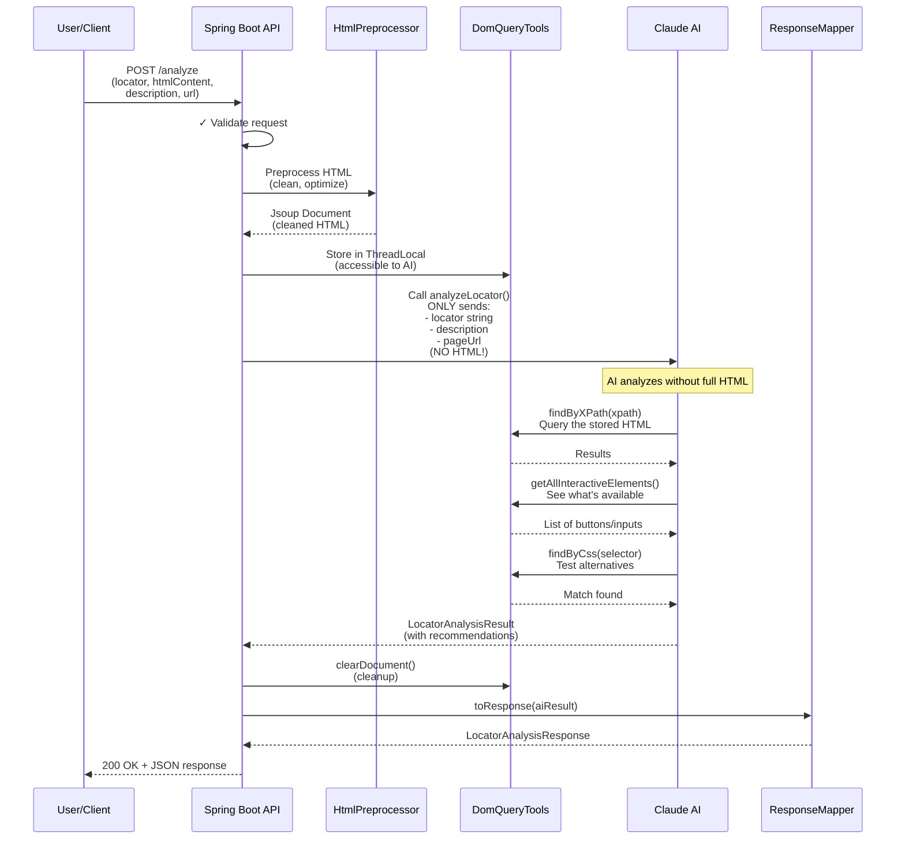
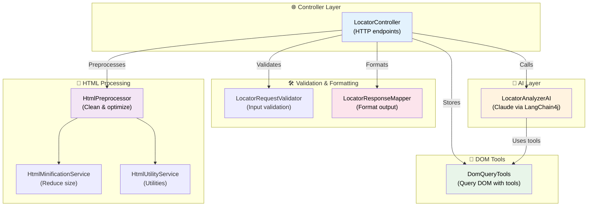
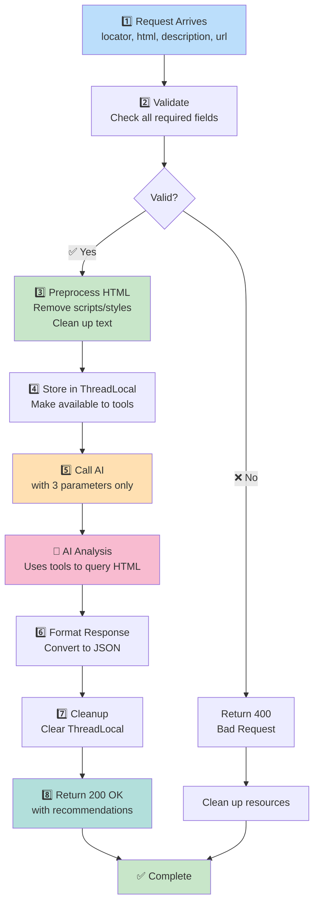
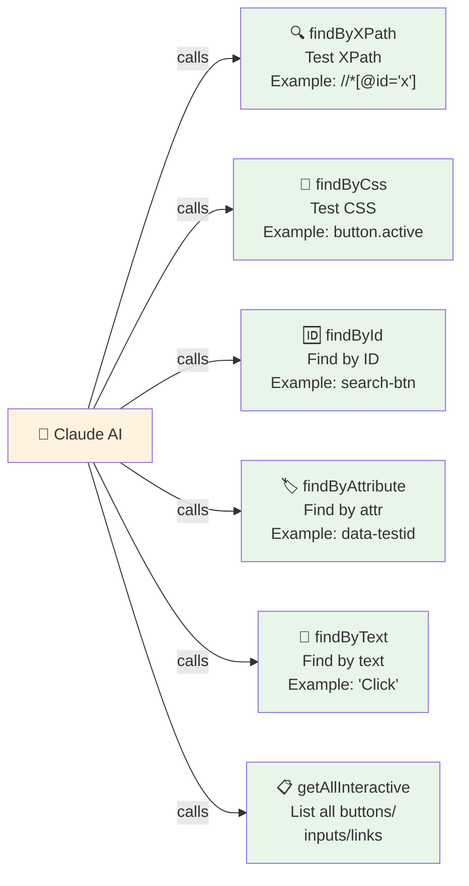
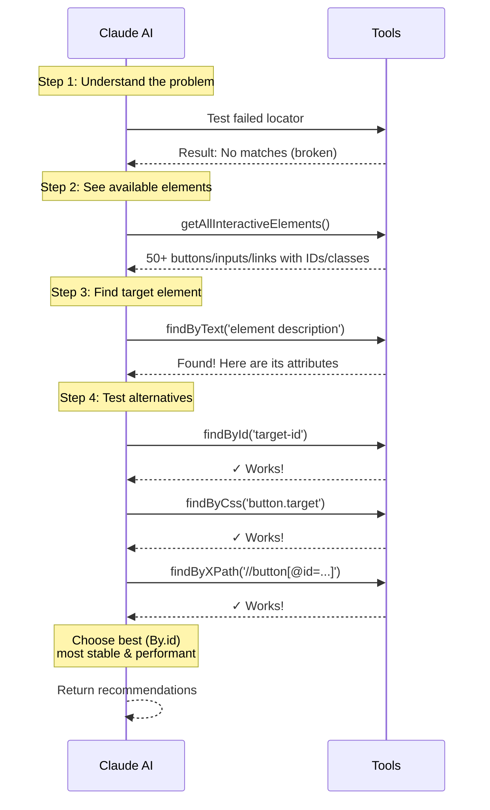
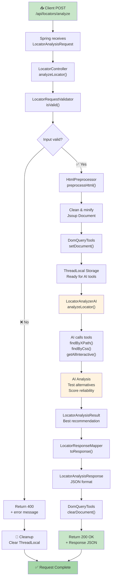
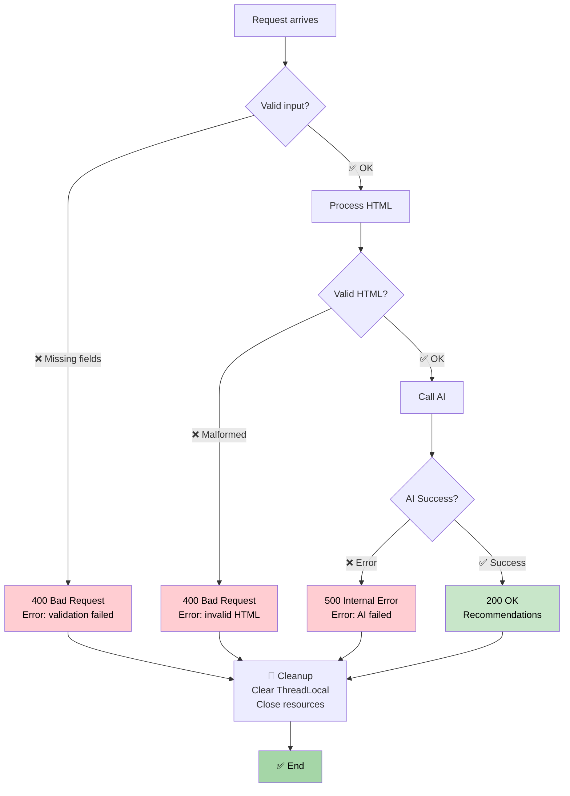

# Flow Diagrams - Visual Guide for New Users

> **Note**: For best viewing of Mermaid diagrams, view this on GitHub.com or use an IDE plugin like Mermaid Viewer
> For IntelliJ, see setup instructions at the end of this file.

## 1️⃣ Main Process Flow (How the System Works)



**What This Shows:**
- User sends request with HTML + locator
- HTML is cleaned and stored (not sent to AI!)
- AI receives only 3 parameters: locator, description, pageUrl
- AI uses tools to query the stored HTML
- Response is mapped and returned to user
- ThreadLocal is cleaned up after response

---

## 2️⃣ Architecture Overview



**Components:**
- **LocatorController**: Handles all HTTP requests
- **Validators**: Check input is valid
- **HtmlPreprocessor**: Cleans HTML, removes scripts/styles
- **DomQueryTools**: Provides tools for AI to query HTML
- **LocatorAnalyzerAI**: Claude AI interface
- **ResponseMapper**: Formats response JSON

---

## 3️⃣ Step-by-Step Processing



**Key Points:**
1. Request validation happens first
2. HTML is preprocessed (optimized, not sent to AI yet!)
3. Cleaned HTML stored in ThreadLocal
4. AI called with only 3 small parameters
5. AI uses tools to query the stored HTML
6. Response formatted and sent back
7. Resources cleaned up

---

## 4️⃣ AI Tool Capabilities



**Available Tools for AI:**

| Tool | Purpose | Example |
|------|---------|---------|
| `findByXPath()` | Test XPath expressions | `//*[@id='login']` |
| `findByCss()` | Test CSS selectors | `button.submit-btn` |
| `findById()` | Find by ID attribute | `search-input` |
| `findByAttribute()` | Find by any attribute | `data-testid='submit'` |
| `findByText()` | Find by visible text | `"Click here"` |
| `getAllInteractiveElements()` | List all clickable/input elements | Returns JSON array |

---

## 5️⃣ AI Analysis Strategy



**Analysis Steps:**
1. Test the original failed locator
2. List all available interactive elements
3. Search for element by description
4. Test multiple alternative locators
5. Score by reliability
6. Return best + alternatives

---

## 6️⃣ Why HTML is NOT Sent to AI

**Traditional Approach (Wasteful):**
```
Request → Controller → AI
          ↓
    (HTML 50KB + parameters)
          ↓
    AI processes (expensive!)
```

**Smart Approach (Efficient):**
```
Request → Controller → Store HTML locally in ThreadLocal
                              ↓
                    AI (gets 3 params only)
                              ↓
                    AI calls tools to query HTML
                              ↓
                    Tools access ThreadLocal (no network!)
```

**Benefits:**
- ✅ **Cost**: Only query what's needed
- ✅ **Speed**: Smaller API payloads
- ✅ **Privacy**: HTML stays on server
- ✅ **Flexibility**: AI decides what to search

---

## 7️⃣ Request Data Flow

**What Gets Sent in Request:**

```
POST /api/locators/analyze
{
  ✅ REQUIRED:
  - locator: "//*[@id='search']"     ← Failed locator
  - htmlContent: "<html>...</html>"  ← Full page HTML

  ➕ OPTIONAL:
  - elementDescription: "Search button"
  - pageUrl: "https://example.com"
}
```

**What AI Actually Receives:**
```
analyzeLocator(
  failedLocator: "//*[@id='search']",
  elementDescription: "Search button",
  pageUrl: "https://example.com"
)
↓
❌ htmlContent NOT sent directly
✅ But available via tools!
```

---

## 8️⃣ Response Data Flow

**What You Get Back:**

```json
{
  "elementFound": true,                    ← Found the element?
  "recommendedLocator": "search-id",       ← Best locator string
  "recommendedLocatorType": "ID",          ← Strategy: ID, CSS, XPATH, etc.
  "alternatives": {                        ← Other working options
    "CSS_SELECTOR": "input#search-id",
    "XPATH": "//*[@id='search-id']",
    "NAME": "q"
  },
  "confidence": 0.95,                      ← 95% confident
  "explanation": "Found input with stable ID..."
}
```

---

## 9️⃣ Complete Request Lifecycle



---

## 🔟 Error Handling



**Error Scenarios:**
- **400**: Invalid request (missing fields, bad HTML)
- **500**: Server error (AI processing failed)
- All scenarios: Resources are cleaned up properly

---

## 1️⃣1️⃣ Locator Type Preference

The AI prefers locators in this order:

```
🥇 By.ID              ⭐⭐⭐⭐⭐ Most stable
                      (Fast, reliable, unique)

🥈 By.NAME            ⭐⭐⭐⭐ Good for forms
                      (Standard attribute)

🥉 By.LINK_TEXT       ⭐⭐⭐⭐ For hyperlinks
                      (Semantic)

4️⃣  By.CSS_SELECTOR   ⭐⭐⭐⭐ Flexible
                      (Performant)

5️⃣  By.CLASS_NAME     ⭐⭐⭐ If unique
                      (Shared classes risky)

6️⃣  By.XPATH          ⭐⭐ Last resort
                      (Brittle, slow)
```

---

## 📚 Example Usage

### Request Example

```json
{
  "locator": "//*[@id='old-search-id']",
  "htmlContent": "<html>...<input id='new-search' name='q' class='search-input'/></html>",
  "elementDescription": "Search input field on top navigation",
  "pageUrl": "https://example.com/products"
}
```

### Response Example

```json
{
  "elementFound": true,
  "recommendedLocator": "new-search",
  "recommendedLocatorType": "ID",
  "alternatives": {
    "NAME": "q",
    "CLASS_NAME": "search-input",
    "CSS_SELECTOR": "input#new-search",
    "XPATH": "//*[@id='new-search']"
  },
  "confidence": 0.98,
  "explanation": "Element found using By.id() strategy - most reliable and performant. ID 'new-search' is stable and unique."
}
```

---

## 🔧 How to View Mermaid Diagrams

### Option 1: View on GitHub ✅ (Easiest)
1. Push this file to GitHub
2. Open in browser → Diagrams render automatically

### Option 2: IntelliJ with Markdown Plugin
1. Install "Markdown" plugin (built-in)
2. Install "Mermaid" plugin from JetBrains marketplace
3. Restart IntelliJ
4. Open .md file → Diagrams render in preview

### Option 3: Online Mermaid Editor
1. Copy diagram code
2. Go to: https://mermaid.live
3. Paste code → View rendered diagram

### Option 4: VSCode
1. VSCode has built-in Mermaid support
2. Just open the .md file → Previews automatically

---

## 📖 Quick Reference

| Concept | Location |
|---------|----------|
| Main flow | Diagram #1 |
| Components | Diagram #2 |
| Processing steps | Diagram #3 |
| AI tools | Diagram #4 |
| AI strategy | Diagram #5 |
| Why design works | Diagram #6 |
| Request format | Diagram #7 |
| Response format | Diagram #8 |
| Full lifecycle | Diagram #9 |
| Error handling | Diagram #10 |
| Locator preferences | Diagram #11 |

---

## 💡 Key Takeaways

1. **HTML uploaded once** → stored locally
2. **AI gets only 3 params** → locator, description, pageUrl
3. **Tools enable querying** → AI intelligently searches HTML
4. **ThreadLocal storage** → efficient, secure, fast
5. **Clean separation** → controller, validation, processing, AI, response
6. **Full error handling** → all scenarios covered
7. **SOLID principles** → maintainable, testable code

---

**For questions, see README.md or DOCUMENTATION.md**
